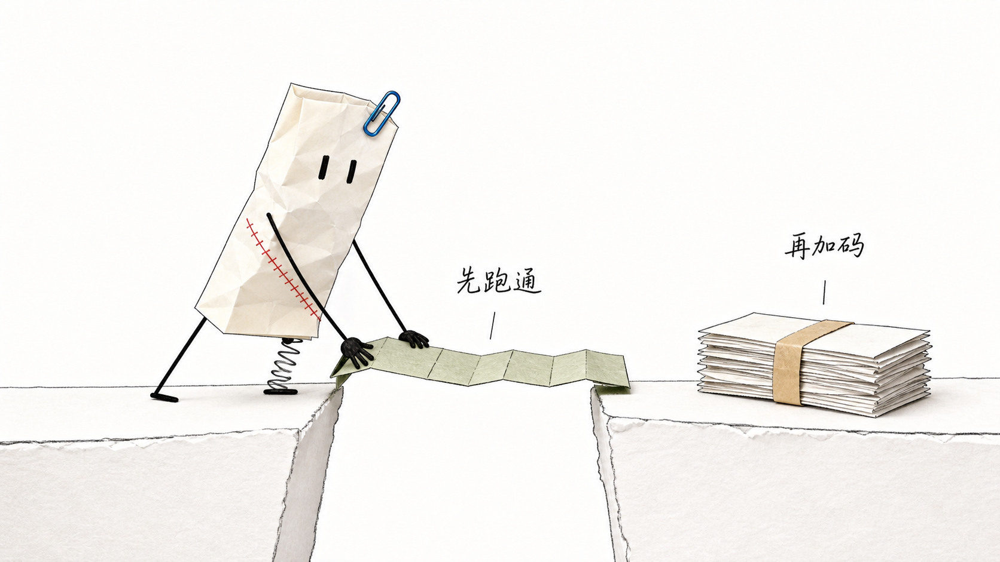
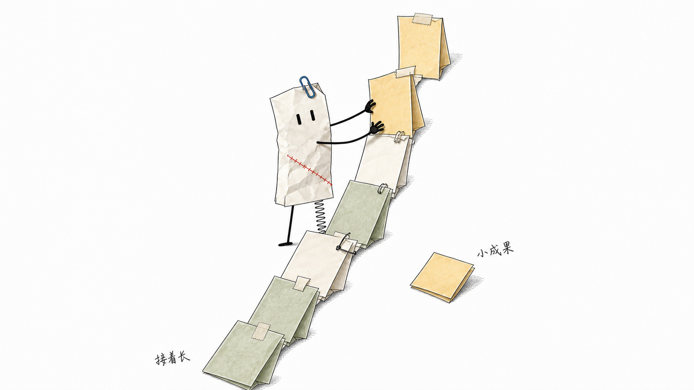

# ROUROU Illustrations

> 把中文文章里的判断、流程、状态和隐喻，折成一张张安静、怪诞、带纸张触感的正文配图。
>
> 16:9 横版｜ROUROU 纸张 IP｜手绘墨线｜克制莫兰迪色｜Codex + WorkBuddy/Claude Code Skill

## 这个仓库是什么

ROUROU Illustrations 是一个可供 Codex 与 WorkBuddy/Claude Code 使用的 Agent Skill，用来为中文文章、帖子、微信文章、博客、Notion 文档和方法论内容规划并生成正文配图。

它不追求商业插画或正式信息图，而是先提炼文章里的“认知动作”，再把一个判断、流程、结构或状态转成可读、有记忆点的纸本隐喻。

默认视觉 IP 是 ROUROU（揉揉）：一张带雾霾蓝回形针、陶土红缝线、直腿和弹簧腿的暖白揉皱纸张小工匠。ROUROU 必须亲手推动结构运转，不能只是站在旁边。

## 视觉语言

- 纯白背景，暖白纸本角色和少量纸质道具
- 炭黑手绘细线、真实折痕、撕边和轻微拼贴厚度
- 主体约占 40%-60%，至少保留约 35% 空白
- 默认每张图只有一个 ROUROU
- 蓝色回形针只属于 ROUROU，普通道具不得复制角色特征
- 一张图只表达一个核心动作、结构、状态或隐喻
- 中文手写批注最多 3-6 处，能不用就不用
- 不做 PPT 信息图、儿童卡通或光滑矢量吉祥物

### 莫兰迪色板

- 炭黑 `#343433`
- 燕麦暖白 `#E8E0D2`
- 陶土红 `#B96F63`
- 雾霾蓝 `#718B9E`
- 鼠尾草绿 `#929D87`
- 灰芥末黄 `#B39A69`
- 灰紫 `#938B9B`

固定保留回形针的雾霾蓝和缝线的陶土红；每张图再选 1-2 个辅助色，彩色面积约 10%-18%。

## 示例

### 信息过载：能处理才有价值


### 最小闭环：先跑通，再加码



### 内容复利：把小成果接着长



示例图只用于校准角色、纸张材质、留白和色彩密度，不是构图模板。

## 安装到 Codex

```bash
git clone https://github.com/rouor/rouor-illustrations.git
cd rouor-illustrations
mkdir -p "${CODEX_HOME:-$HOME/.codex}/skills"
cp -R ./rourou-illustrations "${CODEX_HOME:-$HOME/.codex}/skills/"
```

安装后调用：

```text
Use $rourou-illustrations 为这篇中文文章设计并生成 5 张 ROUROU 纸本正文配图。
```

## 安装到 WorkBuddy / Claude Code

WorkBuddy 基于 Claude Code 运行时，把 Skill 子目录复制到 Claude Code 的用户级技能目录：

```bash
git clone https://github.com/rouor/rouor-illustrations.git
cd rouor-illustrations
mkdir -p "$HOME/.claude/skills"
cp -R ./rourou-illustrations "$HOME/.claude/skills/"
```

只想对当前项目启用时，改为复制到项目内：

```bash
mkdir -p .claude/skills
cp -R /path/to/rouor-illustrations/rourou-illustrations .claude/skills/
```

重新启动 WorkBuddy/Claude Code 会话后调用：

```text
Use $rourou-illustrations 为这篇中文文章规划并生成 5 张 ROUROU 纸本正文配图。
```

Skill 会先发现当前 WorkBuddy/Claude Code 会话里实际可用的图像生成或编辑工具。若没有图像后端，它会输出逐张完整提示词、参考图路径和文件名，并明确标记尚未生图。

## 使用示例

### 只做配图规划

```text
Use $rourou-illustrations 先不要生图。
请分析下面这篇文章哪里值得配图，输出 5 张左右的 shot list。
每张图写清楚：放在哪段后、主题、核心意思、结构类型、ROUROU 的动作、纸本道具和中文标注词。

<粘贴文章>
```

### 直接生成正文配图

```text
Use $rourou-illustrations 把下面这篇文章生成 4 张正文配图。
要求：16:9 横版、纯白背景、暖白纸本 ROUROU、手绘墨线、少量莫兰迪色。
每张图只讲一个核心结构，不要做 PPT 信息图。

<粘贴文章>
```

### 为单个观点生成一张图

```text
Use $rourou-illustrations 为这个观点生成一张正文配图：

先验证最小闭环，再扩大投入。

让 ROUROU 承担核心动作，重新发明一个纸本物理隐喻。
```

更多调用方式见 [examples/prompts.md](examples/prompts.md)。

## 工作流程

1. 提炼文章中的核心观点和认知转折
2. 选择值得视觉化的认知锚点
3. 先输出 shot list
4. 为每张图选择一种结构类型
5. 发明新的纸本物理隐喻
6. 使用角色设定图锁定 ROUROU 身份
7. 按当前宿主选择图像后端，每张图单独生成
8. 按 QA checklist 检查角色、留白、色彩、文字和非 PPT 感
9. 保存 PNG 并报告用途与路径

## 目录结构

```text
.
├── README.md
├── LICENSE
├── NOTICE.md
├── examples/
│   ├── images/
│   └── prompts.md
└── rourou-illustrations/
    ├── SKILL.md
    ├── agents/openai.yaml
    ├── assets/
    │   ├── ip-reference/
    │   └── examples/
    └── references/
        ├── rourou-ip.md
        ├── style-dna.md
        ├── composition-patterns.md
        ├── prompt-template.md
        ├── generation-backends.md
        └── qa-checklist.md
```

真正需要安装到 Codex 或 WorkBuddy/Claude Code 的是 `rourou-illustrations/` 子目录。

## 注意事项

- 角色设定以 `assets/ip-reference/01-turnaround.png` 为最高优先级。
- 中文越短越稳定；错字多时减少标注并重生成。
- 蓝色回形针是 ROUROU 的专属标识，不应出现在普通道具上。
- 示例只校准风格，不复刻构图。
- AI 图像模型仍可能出现角色漂移、多余文字或错误标识，需要生成后检查。
- `agents/openai.yaml` 是 Codex 界面元数据；WorkBuddy/Claude Code 会忽略它，不影响 `SKILL.md` 的执行。

## 来源与许可

本项目基于 Ian 创建的 [Ian Xiaohei Illustrations](https://github.com/helloianneo/ian-xiaohei-illustrations) ROUROU是ROUOR DESIGN 一淼AI创新工作室创意改编，并重新设计了 ROUROU 角色、纸本视觉语言、莫兰迪色板、提示词和示例图。详细署名见 [NOTICE.md](NOTICE.md)。感谢小黑skill的原创skill

MIT License，见 [LICENSE](LICENSE)。
